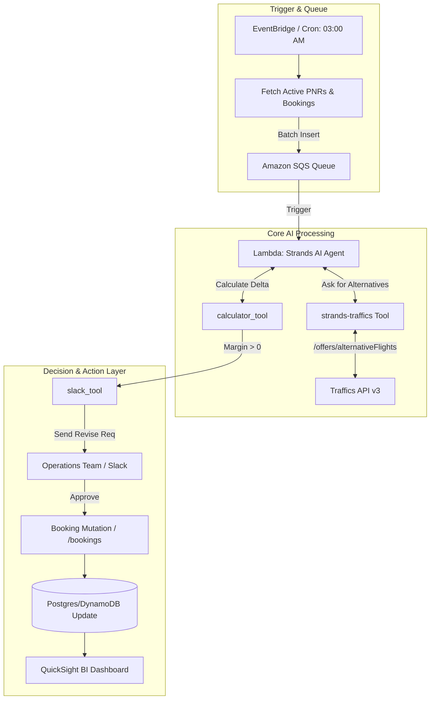

# MarginOptimizer 💼

**B2B Dynamic Alternative Flight & Yield Management System**

MarginOptimizer is a highly automated B2B "Yield Management" engine specifically built to drastically increase travel agency profitability. The Strands Agent acts as an autonomous background worker, constantly analyzing previously sold package holiday ("Pauschal") flight segments and hunting down cheaper, identical alternatives to lock in wider profit margins.

---

## 🎯 Project Vision & Abstract
Months can pass between the sale of a holiday package and its departure. While the originally locked-in flight cost might be 1000 EUR upon booking, 3 months later, an identical alternative flight (different airline, same timing) might drop to 800 EUR. MarginOptimizer fully automates capitalizing on this gap: Nightly, it scans active PNRs, queries the Traffics API `/alternativeFlights`, calculates exact margins, and pings operations staff on Slack. With a single click, human operators can approve the flight change thus creating direct net yield.

## 📊 Business Value & Market Fit
- **Market Size:** Global Yield Management & Dynamic Pricing sector within Travel sits around $5.2 Billion locally (2024). Within B2B, "Cost Saving" technologies are highly lucrative.
- **ROI:** If an agency sells 50,000 packages annually, discovering a cheaper flight saving just 20 EUR on merely 1 in 10 trips equates to an **optional net profit of 100,000 EUR** per year generated from thin air.

---

## 🏗️ System Architecture

Due to the nature of dynamic pricing trackers requiring high volume and strict resilience, the architecture leans entirely on asynchronous AWS Serverless services (EventBridge, SQS) to manage processing throughput.

### 🧩 Technical Stack & Tooling Combinations
1. **AWS Serverless & Queuing:** EventBridge (Triggers), SQS (Queue control mapping), Lambda (Worker host).
2. **Strands Agent:** The primary entity executing decision boundaries, handling rate-limit errors, and contextual calculation looping.
3. **`use_traffics` (Custom Tool):** Maps specifically to `/offers/{code}/alternativeFlights` and `/bookings` mutations.
4. **`calculator`:** Ensure faultless arithmetic difference calculations between New Offer and Existing Offer margins.
5. **`slack` (or Teams) tool:** Dispatches Interactive Webhook buttons ("Approve" / "Reject") to enable the crucial "Human-in-the-Loop" fallback.
6. **BI & Analytics:** Dashboard generation mapping the extracted margins onto QuickSight or Grafana.

---

## ⚙️ Workflow & Lifecycle

1. **Job Definition (Nightly Batch):** Driven by an EventBridge cron, future unflyed "Pauschal" reservations (Booking / Offer IDs) are scraped from the primary Database and pushed to the SQS queue.
2. **Alternative Flight Scan:** Strands Worker pulls from the SQS queue, executing the `use_traffics` tool seeking `/alternativeFlights`.
3. **Filtering & Calculation:** Identifying flights conforming to exact baggage parameters and temporal similarity (max +/- 4 hours), the `calculator` computes the exact Delta between old and new net prices.
4. **Human Notification:** Agent posts a Slack block: *"Booking ID 9912 generated 80 Euro margin overhead. Approve flight revision? User itinerary will adjust slightly."*
5. **Mutation & Rollback:** Upon button click "Approve", system triggers Traffics `/bookings` API to mutate the ticket natively. Triggers rollback sequences natively upon GDS linkage errors.

---

## 🗺️ Roadmap & Development Phases

### Phase 1: Core Agent & Execution Processing (Months 1-1.5)
- [ ] Devise Strands Agent prompt parsing mock JSON PNRs to analyze alternatives natively without hitting quota limits.
- [ ] Deliver deterministic `calculator` logic.
- [ ] Unit testing the rejection loop (Worker must silently close out if no margin exists).

### Phase 2: SQS & Rate Limit Handling (Months 1.5-2.5)
- [ ] AWS SQS configuration and parallel batch mapping design.
- [ ] Hardening the Traffics API Rate-Limit (429 Error) via SQS Exponential Backoff policies.
- [ ] Deploying daily audit consolidations via the Agent `journal` tool.

### Phase 3: Approval Loop & Custom Notification (Month 3)
- [ ] Integrations for Slack Interactive App blocks.
- [ ] Building webhook ingestors acting on manual Slack clicks routed to actual Traffics `/bookings/modify` mutation endpoints.

### Phase 4: Big Data & Dashboards (Months 4+)
- [ ] Pipe extracted analytical margin yields to SQL platforms and QuickSight dashboards showing "CUMULATIVE SAVINGS THIS MONTH".
- [ ] Train advanced statistical modeling arrays pushing forecasted probability fields onto Bedrock.

---

## 👩‍💻 Developer Guide
MarginOptimizer inherently touches heavy data limits and critical financial modification lines. Live API tracking must initially stick purely to Traffics Loopback/Mock APIs. Inject a strict "Are you sure? Dry Run is active" fallback logic into the Strands tool mappings globally to guarantee agency-side reliability throughout development.
