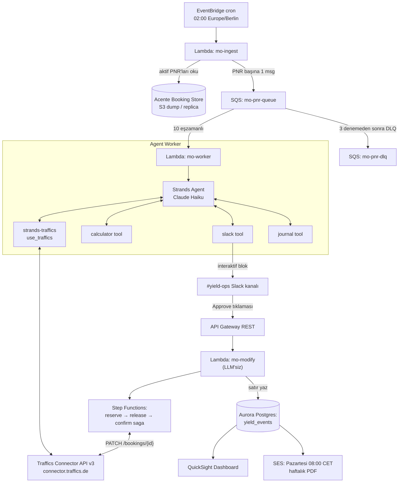

# Teknik Mimari: MarginOptimizer

> **Durum:** Geliştirmeye hazır · **Bölge:** `eu-central-1` · **Son güncelleme:** 2026-04-17

## 1. Sistem Genel Bakışı

MarginOptimizer, AWS üzerinde headless ve asenkron bir batch sistemidir. Geceki EventBridge cron → ingestion → SQS fan-out → PNR başına Strands worker Lambda'ları (Bedrock Claude Haiku) tetikler. Worker'lar `strands-traffics.use_traffics` ile `/offers/{code}/alternativeFlights` çağırır, `strands_tools.calculator` ile kâr delta'sını hesaplar ve Slack'e interaktif onay kartı gönderir. Onaylar, bir API Gateway webhook'una düşer ve **LLM içermeyen** modification Lambda'yı tetikler — bu Lambda Traffics `PATCH /bookings/{id}` mutasyonunu tam rollback desteğiyle bir Step Functions saga'sı içinde çalıştırır. Başarılı mutasyonlar Aurora Postgres `yield_events` tablosuna yazılır; QuickSight dashboard üretir.

## 2. Bileşen Diyagramı



## 3. Teknoloji Yığını (pin'lenmiş)

| Katman | Tercih | Sürüm / ID |
|---|---|---|
| Runtime | Python | 3.12 |
| Paket yöneticisi | `uv` | ≥ 0.5 |
| Agent SDK | `strands-agents` | latest |
| Tool wrapper | `strands-traffics` | 0.1.x |
| Tools paketi | `strands-agents-tools` | latest |
| LLM (worker) | Bedrock Claude Haiku | `us.anthropic.claude-haiku-4-5-20251001-v1:0` |
| Ingest compute | AWS Lambda (zip) | Python 3.12 |
| Worker compute | AWS Lambda (container) | Python 3.12 |
| Modify compute | AWS Lambda (zip, LLM'siz) | Python 3.12 |
| Kuyruk | Amazon SQS standard | visibility = 6 × Lambda timeout |
| Zamanlayıcı | Amazon EventBridge | cron(0 2 * * ? *) EU/Berlin |
| Orkestrasyon | AWS Step Functions | Standard (saga) |
| State | Amazon Aurora PostgreSQL | 15.x, Serverless v2 |
| Secret | AWS Secrets Manager | — |
| Dashboard | Amazon QuickSight | Enterprise edition |
| Haftalık rapor | Amazon SES | — |
| IaC | AWS CDK (TypeScript) | ≥ 2.150 |
| Gözlemlenebilirlik | CloudWatch Logs & Metrics | — |

## 4. Minimal Agent Kodu (referans)

```python
# src/margin_optimizer/worker.py
import os, json
from strands import Agent
from strands.models import BedrockModel
from strands_traffics import use_traffics
from strands_tools import calculator, slack, journal

from .hooks import AuditHooks
from .prompts import WORKER_SYSTEM_PROMPT

def build_worker_agent() -> Agent:
    return Agent(
        agent_id="mo-worker",
        model=BedrockModel(
            model_id=os.environ.get(
                "BEDROCK_MODEL_ID",
                "us.anthropic.claude-haiku-4-5-20251001-v1:0",
            ),
            region_name=os.environ.get("AWS_REGION", "eu-central-1"),
            temperature=0.0,  # deterministik parsing
            streaming=False,
        ),
        system_prompt=WORKER_SYSTEM_PROMPT,
        tools=[use_traffics, calculator, slack, journal],
        hooks=[AuditHooks()],
    )

def handler(event, context):
    for record in event["Records"]:
        payload = json.loads(record["body"])
        agent = build_worker_agent()
        prompt = (
            f"Booking {payload['booking_id']}: offerCode={payload['offer_code']}, "
            f"mevcut uçak maliyeti={payload['current_price']} EUR, "
            f"bagaj={payload['baggage']}, sınıf={payload['class']}. "
            f"Traffics üzerinden eşdeğer daha ucuz alternatif bul. "
            f"Yalnızca {os.environ['MIN_MARGIN_EUR']} EUR'dan fazla kazandıranları sun."
        )
        agent(prompt)
```

## 5. Veri Akışları

### 5.1. Gece ingest

1. EventBridge `cron(0 2 * * ? *)` (TZ Europe/Berlin) → `mo-ingest`.
2. `mo-ingest`, günün aktif PNR snapshot'ını S3'ten okur (başlangıçta günlük dump; 2. ayda read replica'ya yükselt).
3. Filtreler: `status = CONFIRMED`, `departure_date > now() + 24h`.
4. PNR başına SQS'e bir mesaj (≈ 500 bayt payload).
5. Metrik yayar: `ScannedPnrs` = enqueue edilen mesaj sayısı.

### 5.2. Worker (PNR başına)

6. `mo-worker` Lambda'sı, concurrency = 10 ile SQS'i 10'lu batch'lerde okur (≈ 5 TPS Traffics).
7. Agent şöyle çağırır:
   ```json
   use_traffics(service="offers", endpoint="alternative_flights", params='{"code": "TRAF-9921"}')
   ```
8. Agent adayları süzer — bagajı değiştiren, saatleri > 3 saat kaydıran, > 4 saat aktarma ekleyen veya sınıf tier'ını değiştiren alternatifleri düşürür.
9. Agent `calculator`'ı tam şu prompt ile çağırır: `"<old_price> - <new_price>"`.
10. Delta > `MIN_MARGIN_EUR` ise agent `slack`'i interaktif blok ile çağırır (bkz. 5.3). Aksi halde agent `"Task Complete. No action needed."` yazıp çıkar.

### 5.3. Slack onay kartı

```json
{
  "blocks": [
    {"type": "section", "text": {"type": "mrkdwn",
      "text": "*Kâr fırsatı* · Booking `9921` · Müşteri `M.Y.`"}},
    {"type": "section", "fields": [
      {"type": "mrkdwn", "text": "*Eski:* TK1234 500 €"},
      {"type": "mrkdwn", "text": "*Yeni:* PC3030 420 €"},
      {"type": "mrkdwn", "text": "*Delta:* +80 € (%16)"},
      {"type": "mrkdwn", "text": "*Bagaj:* 1x20kg ✅"}
    ]},
    {"type": "actions", "elements": [
      {"type": "button", "style": "primary",
       "text": {"type": "plain_text", "text": "Onayla"},
       "value": "{\"booking_id\":\"9921\",\"offer_code_new\":\"PC3030\"}",
       "action_id": "approve_swap"},
      {"type": "button", "style": "danger",
       "text": {"type": "plain_text", "text": "Reddet"},
       "action_id": "reject_swap"}
    ]}
  ]
}
```

### 5.4. Onay → mutasyon saga'sı (LLM'siz)

11. Slack interaktif payload'ı POST eder → API Gateway `/slack/actions` → `mo-modify` Lambda.
12. `mo-modify` Slack HMAC imzasını doğrular (`X-Slack-Signature`, `X-Slack-Request-Timestamp`) — 5 dk'dan eski ise reddeder.
13. Step Functions execution başlatır (saga):
    - **Adım 1:** `reserve_new_flight` → Traffics `POST /offers/{new}/reserve`.
    - **Adım 2:** `release_old_flight` → Traffics `DELETE /offers/{old}/reservation`.
    - **Adım 3:** `confirm` → Traffics `PATCH /bookings/{id}` (idempotency key = `{booking_id}:{offer_code_new}`).
14. Herhangi bir adımda hata → önceki adımları geri alan compensating action'lar — orijinal booking el değmemiş kalır.
15. Başarıda: `yield_events` satırı insert; Slack'e 200 ack; thread içine onay bloğu gönder.

### 5.5. Gözlemlenebilirlik & raporlama

- CloudWatch metrikleri: `ScannedPnrs`, `ProfitableAlternativesFound`, `ApprovedChanges`, `RejectedChanges`, `MutationFailures`.
- `yield_events` şeması: `id, booking_id, old_offer_code, new_offer_code, delta_eur, approved_by, approved_at, mutated_at, status`.
- QuickSight dataset saatlik refresh.
- Pazartesi 08:00 CET: `mo-weekly-report` Lambda'sı headless Chrome ile PDF üretir → SES.

## 6. Ortam Değişkenleri

| Değişken | Kapsam | Örnek |
|---|---|---|
| `AWS_REGION` | hepsi | `eu-central-1` |
| `BEDROCK_MODEL_ID` | worker | `us.anthropic.claude-haiku-4-5-20251001-v1:0` |
| `MIN_MARGIN_EUR` | worker, modify | `30` |
| `MAX_DEPARTURE_SHIFT_HOURS` | worker | `3` |
| `TRAFFICS_API_KEY` | worker, modify | Secrets Manager |
| `SLACK_BOT_TOKEN` | worker | Secrets Manager |
| `SLACK_SIGNING_SECRET` | modify | Secrets Manager |
| `SLACK_CHANNEL_ID` | worker | `C01ABCD2345` |
| `YIELD_DB_URL` | modify, weekly | `postgresql://...` (Secrets Manager) |
| `DRY_RUN` | modify | staging'de `true` — PATCH'i atlar |
| `BYPASS_TOOL_CONSENT` | worker | `true` (Lambda'da zorunlu) |

## 7. Secrets Manager Düzeni

| Secret adı | Anahtarlar |
|---|---|
| `mo/{env}/traffics` | `apiKey` |
| `mo/{env}/slack` | `botToken`, `signingSecret` |
| `mo/{env}/db` | `host`, `port`, `user`, `password`, `dbname` |

## 8. IAM (least-privilege)

**`mo-ingest` rolü:** booking-dump bucket'ına `s3:GetObject`; `mo-pnr-queue` için `sqs:SendMessage`; `secretsmanager:GetSecretValue`; CloudWatch Logs.

**`mo-worker` rolü:** kuyrukta `sqs:ReceiveMessage`, `DeleteMessage`; Haiku ARN için `bedrock:InvokeModel`; `secretsmanager:GetSecretValue`; Slack `chat.postMessage` (IAM değil, token ile).

**`mo-modify` rolü:** saga state machine ARN'si için `states:StartExecution`; `secretsmanager:GetSecretValue`; `yield_events` için `rds-data:ExecuteStatement`.

**Tüm rollerde açıkça yasaklanan:** `iam:*`, altyapı mutasyonu, adlandırılmış bucket'lar dışındaki S3.

## 9. Saga State Machine (ASL taslağı)

```json
{
  "StartAt": "ReserveNew",
  "States": {
    "ReserveNew": {
      "Type": "Task",
      "Resource": "arn:aws:lambda:...:function:mo-traffics-reserve",
      "Catch": [{"ErrorEquals": ["States.ALL"], "Next": "RollbackNothing"}],
      "Next": "ReleaseOld"
    },
    "ReleaseOld": {
      "Type": "Task",
      "Resource": "arn:aws:lambda:...:function:mo-traffics-release",
      "Catch": [{"ErrorEquals": ["States.ALL"], "Next": "CompensateReserve"}],
      "Next": "Confirm"
    },
    "Confirm": {
      "Type": "Task",
      "Resource": "arn:aws:lambda:...:function:mo-traffics-confirm",
      "Catch": [{"ErrorEquals": ["States.ALL"], "Next": "CompensateAll"}],
      "Next": "WriteYieldEvent"
    },
    "WriteYieldEvent": {"Type": "Task", "Resource": "...", "End": true},
    "RollbackNothing": {"Type": "Pass", "Next": "FailJournal"},
    "CompensateReserve": {"Type": "Task", "Resource": "...", "Next": "FailJournal"},
    "CompensateAll": {"Type": "Task", "Resource": "...", "Next": "FailJournal"},
    "FailJournal": {"Type": "Task", "Resource": "...", "End": true}
  }
}
```

## 10. Dayanıklılık

| Arıza | İşleme |
|---|---|
| Traffics 429 | `strands-traffics` içindeki `urllib3.Retry` (3 deneme, 0.5 s). Kalıcı → 3 SQS denemesinden sonra DLQ. |
| Saga sırasında Traffics 5xx | Step Functions retry + catch → compensating action. |
| Slack kesintisi | Worker fırsatı `journal` ile kaydeder; Slack'in çalışmadığı günlerde 08:00 SES digesti gönderilir. |
| Bedrock throttling | `ModelRetryStrategy` default. Hit oranı > %10 ise worker concurrency düşürülür. |
| DB yazma hatası | `yield_events` satırı fallback SQS'e kuyruğa alınır; 5 dk'da bir replay. |
| Saga kısmi hata | Compensating transaction + Slack thread'ine kırmızı journal girdisi post'u. |

## 11. Maliyet & Ölçekleme

- **Maliyet tavanı:** PNR başına ≤ 0.005 €. 10k PNR = gecede ≤ 50 €. Dağılım:
  - Haiku: PNR başına ~300 token giriş + ~200 çıkış @ $0.80/$4.00 per 1M → ≈ $0.001.
  - Traffics: acente kontratı (flat varsayılıyor).
  - AWS Lambda + SQS: mevcut fiyatlandırmada 10k PNR için < 10 €.
- **Worker concurrency tabanı:** 10 (PNR başına 2 çağrı ile ≈ 5 Traffics TPS).
- **Worker concurrency tavanı:** yalnızca Traffics > 10 TPS tahsis ettiğinde yükselt.
- **Aurora Serverless v2 ACU:** min 0.5, max 4 — QuickSight query yükü ile ölçeklenir.

## 12. Güvenlik

- Her DB okuma veya Traffics yazma öncesi Slack HMAC doğrulaması zorunlu.
- Timestamp skew toleransı: 5 dk (replay saldırılarını engeller).
- Traffics API key her ortamda ayrı; 90 günde bir Secrets Manager rotation ile döndürülür.
- CloudWatch'ta PII yok: worker log'ları sadece müşteri baş harflerini içerir (örn. `M.Y.`).
- Dry-run default: yeni ortamlar ilk yeşil staging canary'ye kadar `DRY_RUN=true` ile gelir.
- Egress allowlist: `bedrock.eu-central-1.amazonaws.com`, `connector.traffics.de`, `slack.com`.

## 13. Açık Mimari Kararlar

- **`yield_events` için Aurora mı DynamoDB mi?** Aurora — QuickSight SQL'i native kullanıyor; `route_pair`, `airline_pair` üzerinde analitik join'ler kolay.
- **Booking ingest için direct replica mı günlük dump mu?** MVP: günlük S3 dump (basit, acente tarafında minimum iş). 2. ay: 15 dk tazelikte Postgres logical replica'ya yükselt.
- **Reddedilmiş alternatiflerin yeniden önerilmesi?** MVP: aynı PNR/rotada reddedilen swap tekrar önerilmez. Faz 2: filtre eşiklerini iyileştirmek için rejection pattern'lerinden öğren.
